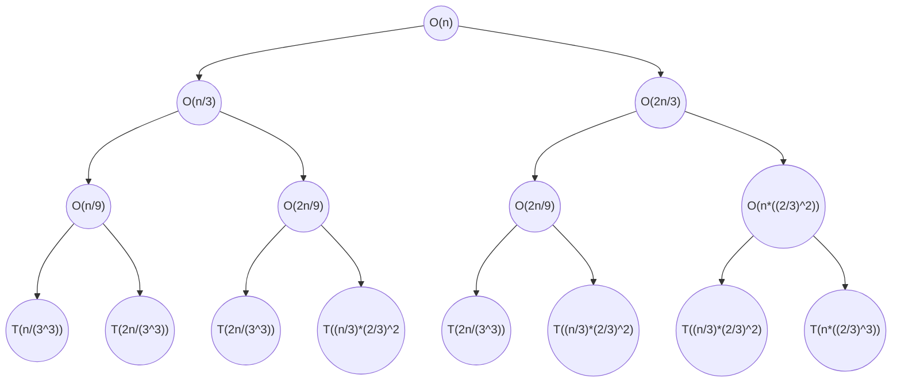

    Name : Fadi Alahmad Alomar

    ID : 1200180049

# Assignment 2: Recurrences

## Question 1

- $\because$ We are looking for $T(n,n)$ the recurrence equation becomes
$T(n,n) = T(\frac{n}{2},\frac{n}{2}) + \Theta(n)$ and $T(1,1) = \Theta(1)$
- Which can be further simplifed into
$T'(n) = T'(\frac{n}{2}) + \Theta(n)$
- Then using the master theorem we get
$b=2,\space a=1,\space f(n) = n$
$c_{crit} = \log_{b}{a} = {\log_{2}{1}} = 0$
$f(n) = n = \Omega(n^c)$ where $c = 1$
$\because c>c_{crit}$
$\therefore T'(n) = \Theta(n)$

## Question 2

**(a)** $T(n) = 3T(\frac{n}{2}) + n^2$

- using the master theorem we get
$b=2,\space a=3,\space f(n) = n^2$
$c_{crit} = \log_{b}{a} = {\log_{2}{3}} = 1.585$
$f(n) = n^2 = \Omega(n^c)$ where $c = 2$
$\because c>c_{crit}$
$\therefore T(n) = \Theta(n^2)$

**(b)** $T(n) = 4T(\frac{n}{2}) + n^2$

- using the master theorem we get
$b=2,\space a=4,\space f(n) = n^2$
$c_{crit} = \log_{b}{a} = {\log_{2}{4}} = 2$
$\because f(n) = n^2 = \Theta(n^{c_{crit}}\log^{k}{n})$ where $k = 0$
$\therefore T(n) = \Theta(n^{c_{crit}}\log^{k+1}{n}) = \Theta(n^2\log{n})$

**(c)** $T(n) = T(\frac{n}{2}) + 2^n$

- using the master theorem we get
$b=2,\space a=1,\space f(n) = 2^n$
$c_{crit} = \log_{b}{a} = {\log_{2}{1}} = 0$
$f(n) = 2^n = \Omega(n^c)$ where $c \ge 1$
$\because c>c_{crit}$
$\therefore T(n) = \Theta(f(n)) = \Theta(2^n)$

**(d)** $T(n) = 2^nT(\frac{n}{2}) + n^n$

- the master theorem can not be applied as $a$ is not a constant

**(e)** $T(n) = 16T(\frac{n}{4}) + n$

- using the master theorem we get
$b=4,\space a=16,\space f(n) = n$
$c_{crit} = \log_{b}{a} = {\log_{4}{16}} = 2$
$f(n) = n = O(n^c)$ where $c = 1$
$\because c_{crit}>c$
$\therefore T(n) = \Theta(n^{c_{crit}}) = \Theta(n^2)$

**(f)** $T(n) = 2T(\frac{n}{2}) + \frac{n}{\log{n}}$

- at first the master theorem seems to work and it is in the secound case as $c = c_{crit} = 1$ but $f(n)=\Theta(n^{c_{crit}}\log^{k}{n})$ where $k = -1$ and $k$ has the range $k \ge 0$ thus it is out of range.
and $\frac{f(n)}{n^{\log_{b}{a}}} = \frac{n\log^{-1}n}{n} = \frac{1}{\log n}$ which is smaller than $n^{\epsilon}$ for any $\epsilon$

**(g)** $T(n) = 2T(\frac{n}{4}) + n^{0.51}$

- using the master theorem we get
$b=4,\space a=2,\space f(n) = n^{0.51}$
$c_{crit} = \log_{b}{a} = {\log_{4}{2}} = 0.5$
$f(n) = n^{0.51} = O(n^c)$ where $c = 0.51$
$\because c>c_{crit}$
$\therefore T(n) = \Theta(f(n)) = \Theta(n^{0.51})$

**(h)** $T(n) = 0.5T(\frac{n}{2}) + n^{-1}$

- master theorem does not apply as $a<1$

**(i)** $T(n) = 16T(\frac{n}{4}) + n!$

- using the master theorem we get
$b=4,\space a=16,\space f(n) = n!$
$c_{crit} = \log_{b}{a} = {\log_{4}{16}} = 2$
$f(n) = n! = \Omega(n^c)$ where $c \ge 1$
$\because c>c_{crit}$
$\therefore T(n) = \Theta(f(n)) = \Theta(n!)$

**(j)** $T(n) = \sqrt{2}T(\frac{n}{2}) + \log{n}$

- using the master theorem we get
$b=2,\space a=\sqrt{2},\space f(n) = \log{n}$
$c_{crit} = \log_{b}{a} = {\log_{2}{\sqrt{2}}} = 0.5$
$f(n) = \log{n} = O(n^c)$ where $c = 0.4$
$\because c_{crit}>c$
$\therefore T(n) = O(n^{c_{crit}}) = O(n^{0.5})$

**(k)** $T(n) = 6T(\frac{n}{3}) + n^{2}\log{n}$

- using the master theorem we get
$b=3,\space a=6,\space f(n) = n^{2}\log{n}$
$c_{crit} = \log_{b}{a} = {\log_{3}{6}} = 1.631$
$f(n) = n^{2}\log{n} = \Omega(n^c)$ where $c =2$
$\because c>c_{crit}$
$\therefore T(n) = \Theta(f(n)) = \Theta(n^{2}\log{n})$

**(l)** $T(n) = 4T(\frac{n}{2}) + \frac{n}{\log{n}}$

- using the master theorem we get
$b=2,\space a=4,\space f(n) = \frac{n}{\log{n}}$
$c_{crit} = \log_{b}{a} = {\log_{2}{4}} = 2$
$f(n) = \frac{n}{\log{n}} = O(n^c)$ where $c = 1$
$\because c_{crit}>c$
$\therefore T(n) = O(n^{c_{crit}}) = O(n^{2})$

**(m)** $T(n) = 64T(\frac{n}{8}) - n^2\log{n}$

- the master theorem can not be applied as $f(n)$ is a negative value

**(n)** $T(n) = 7T(\frac{n}{3}) + n^{2}$

- using the master theorem we get
$b=3,\space a=7,\space f(n) = n^{2}$
$c_{crit} = \log_{b}{a} = {\log_{3}{7}} = 1.771$
$f(n) = n^{2} = \Omega(n^c)$ where $c = 2$
$\because c>c_{crit}$
$\therefore T(n) = \Theta(f(n)) = \Theta(n^{2})$

**(o)** $T(n) = 4T(\frac{n}{2}) + \log{n}$

- using the master theorem we get
$b=2,\space a=4,\space f(n) = \log{n}$
$c_{crit} = \log_{b}{a} = {\log_{2}{4}} = 2$
$f(n) = \log n = O(n^c)$ where $c = 1$
$\because c_{crit}>c$
$\therefore T(n) = O(n^{c_{crit}}) = O(n^{2})$

**(p)** $T(n) = T(\frac{n}{2}) + n(2-\cos{n})$

- the master theorm should apply and use the third case but it does not as $f(n)$ cannot be a complexity function because it breaks the regularity condition where $af(\frac{n}{b}) \le k f(n)$ where $k < 1$.
if we take $k = \lim_{x \to 1,x\not ={1}}{x}$ and put $n = 6$ we get $f(n) = 6.239,\space f(\frac{n}{2}) = 8.9699$

## Question 3

- $\because$ We are looking for $T(n,n)$ the recurrence equation becomes
$T(n,n) = S(n,\frac{n}{2}) + \Theta(n) = T(\frac{n}{2},\frac{n}{2}) + \Theta(n) + \Theta(n)$
- Which can be further simplifed into
$T'(n) = T'(\frac{n}{2}) + 2\Theta(n) = T'(\frac{n}{2}) + \Theta(n)$
- Then using the master theorem we get
$b=2,\space a=1,\space f(n) = n$
$c_{crit} = \log_{b}{a} = {\log_{2}{1}} = 0$
$f(n) = n = \Omega(n^c)$ where $c = 1$
$\because c>c_{crit}$
$\therefore T'(n) = \Theta(n)$

## Quesstion 4

**(a)** $T(n) = 2T(\lfloor \sqrt{n} \rfloor) + \log{n}$
Let $n=2^k$
$T(2^k)=2T(2^{\frac{k}{2}})+k$
Let $T(2^k)=S(m)$
$\therefore S(m)=2S(m/2)+m$

- Then using the master theorem we get
  
$b=2,\space a=2,\space f(m) = m$
$c_{crit} = \log_{b}{a} = {\log_{2}{2}} = 1$
$f(m) = m = \Omega(m^c)$ where $c = 1$
$\because f(m) = m^{1} = \Theta(m^{c_{crit}}\log^{k}{m})$ where $k = 0$
$\therefore T(m) = \Theta(m^{c_{crit}}\log^{k+1}{m}) = \Theta(m\log{m})$
substiting $m$ by $\log n$ which is equal to $2^k$ we get
$T(n) = \Theta(\log n * \log{(\log n)})$

**(b)** $T(n) = T(\frac{n}{3}) + T(\frac{2n}{3}) + O(n)$

in every level we do exactly $O(n)$ work.
it can be easily shown from the tree that the longest branch that detemines it is height is the one that is far on the right.
the tree terminates when $T(1)$
$\therefore 1 = n*(\frac{2}{3})^i \leadsto i = \log_{\frac{3}{2}}{n}$
$\therefore T(n) = \sum_{i=0}^{\log_{\frac{3}{2}}{n}}{n} = n((\log_{\frac{3}{2}}{n})+1) = O(n\log n)$
