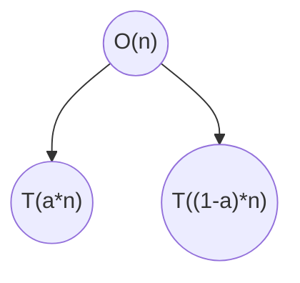
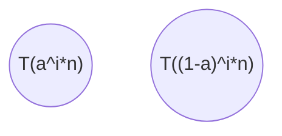

<p style="font-family: times; font-size:18pt">
    Name: Fadi Alahmad Alomar</br>ID: 120180049
</p>

# Assignment 5: Sorting

## Question 1

The permutation is as follows have the odd number s sorted at the beginning and then all the even numbers to be reversely sorted after them e.g:
$[1,3,5,7,.....,8,6,4,2]$ this way when we call the function the first time it will take $[1,n,2]$ if n is odd and $[1,n-1,2]$ if n is even of which the median is 2 then after partitioning we get $[1,2,3,5,7,.....,8,6,4]$ the next call we do will take $[3,n,4]$ and it continues with this pattern always portioning in $1:n-2$ which leads to it being $\Omega(n^2)$

## Question 2

it will be $\Theta(n^2)$ as in each comparison the pivot will be put in first or last depending on the comparison operators

## Question 3



at level i



since $\alpha \le \frac{1}{2}$
$\therefore$ the branch with $T(\alpha^i*n)$ is the minimum and the other is the maximum

- minimum
$T(1) = T(\alpha^i*n)$
$1 = \alpha^i*n$
$\log{n^{-1}} = i* \log{\alpha}$
$\therefore i = - \frac{\log n}{\log \alpha}$
- maximum
$T(1) = T(\alpha^i*n)$
$1 = (1-\alpha)^i*n$
$\log{n^{-1}} = i* \log{(1-\alpha)}$
$\therefore i = - \frac{\log n}{\log {(1-\alpha)}}$

## Question 4

1. I would send the data in reverse order which would always cause the system to run in $\Theta(n^2)$

2. i would shuffle the data to get them back to their random order

## Question 5

we can achieve this by pivoting around the median until we get a subset S of size d or smaller then we need to sort this subset in a way that all of it subsets to be fuzzy sorted so if the first subset is not part of the current d and it is part of the smaller S or the last subset is part of the bigger S.
this can be done by knowing the minimum and maximum of S and if an element intersects with the minimum put it at the beginning if it does with the maximum put it at the end.
this is possible because a subset of size d can only have at most 2 subsets intersecting otherwise the condition of each interval overlapping with at least b-1 others wont hold.

```python
Function fuzzy(arr,d):
    if arr.len <= d:
        return Sort(arr)
    med -> Median(arr)
    left, right -> Partition(arr,med)
    left -> fuzzy(left,d)
    right -> fuzzy(right,d)
    return left + med + right

Function Sort(arr):
    mn -> min(arr)
    mx -> max(arr)
    ans -> Dequeue[arr.len]
    for int i=0; i< arr.len; i++:
        if Intersect(arr[i],mn):
            ans.addFront(arr[i])
        else:
            ans.addBac(arr[i])
    return ans
```
