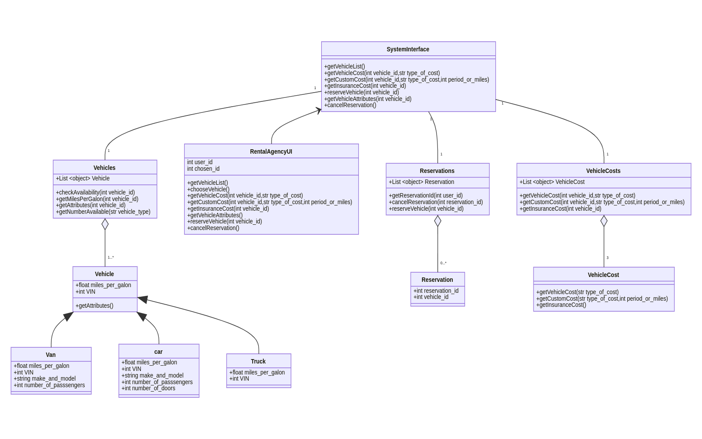

    Name : Fadi Alahmad Alomar

    ID : 1200180049

# Lab 2 UML:

## Question 2.1:

1. (b)
2. n UML class diagrams are used to express the **static** aspects of a design, and **interaction diagrams**
are used to denote the dynamic aspects
3. (c) 
4. (b) 
5. (a)
6. (b)

  
 
  
 
  
 
  
 
  
 
  
 
  
 
  
 
  
 

## Question 2.2:

  

the above class diagram was made using mirmaid which is a js based diagramming and charting tool that renders Markdown-like sharts
