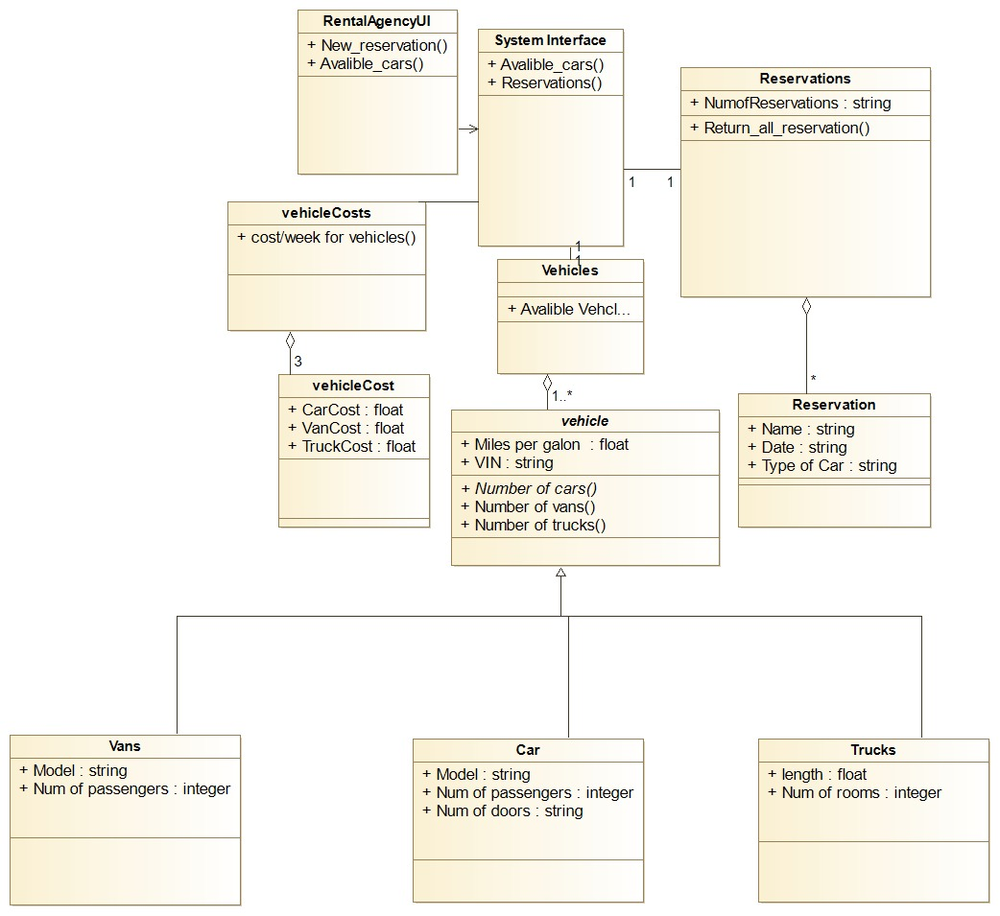

## Name : Abdelrahman Medhat Saad Nawar
## ID : 120180025
## CSE323 Lab1

**Question 2.1**

[1] b

[2] In UML, class diagrams are used to express the **static** aspect of the design, and **Interaction Diagram** are used to denote the dynamic aspects

[3] c

[4] b

[5] a

[6] b 

**Question2.2**

  
