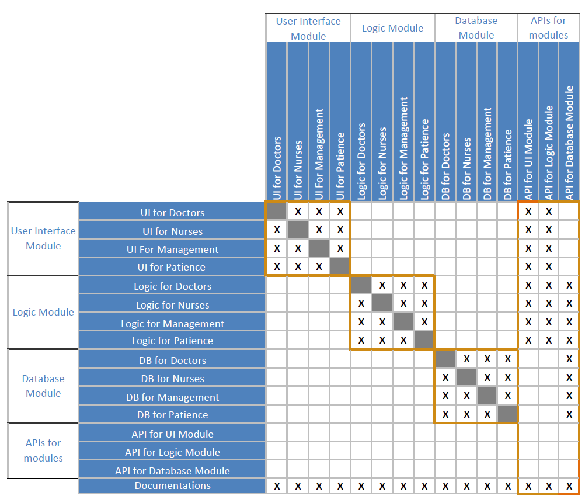
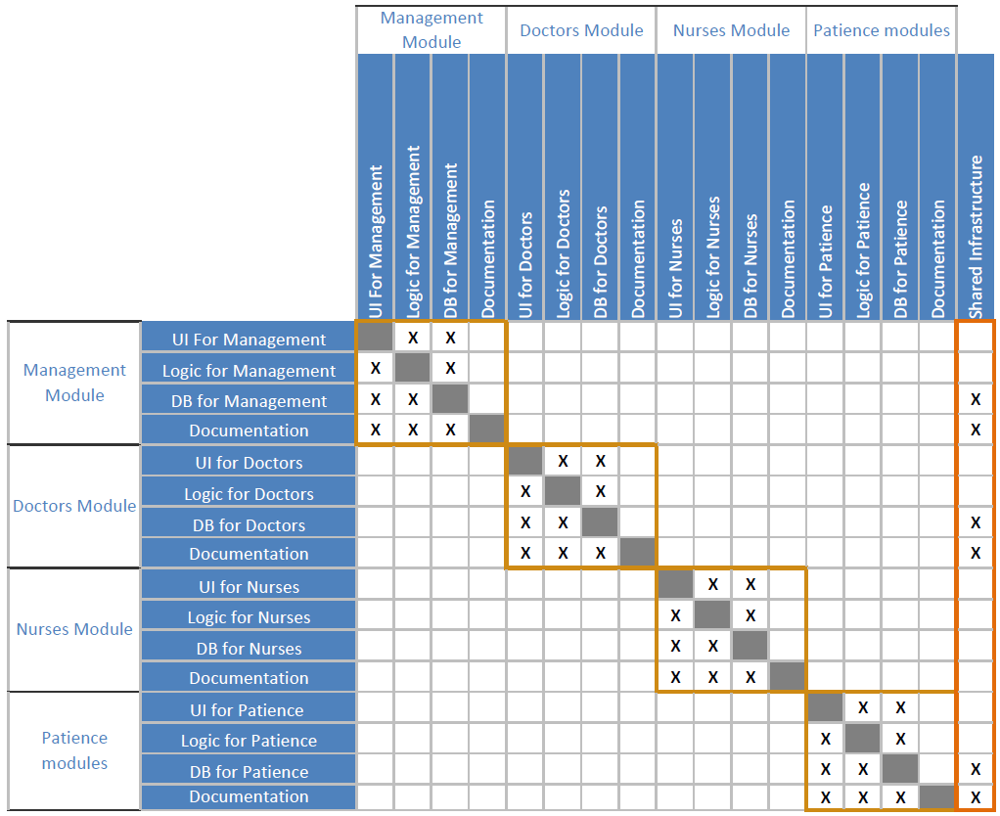

    Name : Fadi Alahmad Alomar
     ID : 120180049

# Tutorial 4

    The problem can be divided in two ways one that is based on expertise and one that is based on the problem itself

- **Based on expertise:**
  It will be divided into UI, Logic, Database and documentations. each part has its own team.
  In this case the Dependency matrix will be:
  

- **Based on the problem:**
  My idea was to divide it based on the people it is serving thus it was divided into four main categories:
  **a.** Management
  **b.** Doctors
  **c.** Nurses
  **d.** Patience
  in this case the Dependency matrix will be:
    
