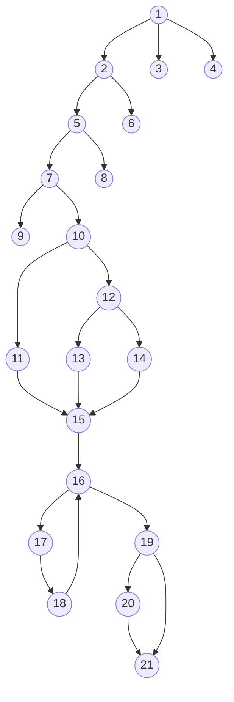

    Name : Fadi Alahmad Alomar

    ID : 1200180049

# Lab 4 BlackBox & WhiteBox Testing

## Problem 1

### Input

|Case #|Description|Input|
|:-:|-|:-:|
|1|a valid case|39223 18 10 10 10 101|
|2|total size too large case|39227 33 20 20 20 105|
|3|one dimension too large case|39225 33 40 10 10 104|
|4|weight too big case|39226 60 10 10 10 109|
|5|unknown zone case|39229 18 10 10 10 200|
|6|unknown\corrupted input case|NULL a 12|

### Output

|Transaction #|Weight|Zone|Charge|Rejection Message|
|:---:|:---:|:---:|:---:|:---:|
|39223|18|101|36.50|
|39227|-|-|-|Size too large.|
|39225|-|-|-|Size too large.|
|39226|-|-|-|Weight too large.|
|39229|18|-|-|Unknown zone.|
|-|-|-|-|Unknown input.|
|1 packages accepted.|
|4 packages rejected.|
|1 input was unknown|
 

## Problem 2

1:  if income input is valid
2:  if income is smaller than 0
3:  income is not a valid number
4:  some IO error occurred
5:  if nFamilyMembers input is valid
6:  program terminated
7:  if nFamilyMembers <= 0
8:  some IO error occurred
9:  program terminated
10: if income < 10000
11: taxTotal=0.12\*income
12: if income < 50000
13: taxTotal=300+0.24*(income-10000)
14: taxTotal=1500+0.36*(income-50000)
15: i=0
16: if i<= nFamilyMembers
17: toxTotal = taxTotal - 100
18: i++
19: if taxTotal < 0
20: taxTotal = 0
21: print the result

- there is a total of 11 paths
 

<table><thead><tr><th rowspan="2"></th><th colspan="6">Income</th><th colspan="2">nFamilyMembers</th><th colspan="2">taxTotal</th></tr><tr><td>&lt;10000</td><td>&lt;50000</td><td>&gt;50000</td><td>&lt;0</td><td>Invalid</td><td>IO error</td><td>IO error</td><td>&lt;=0</td><td>&lt;0</td><td>&gt;0</td></tr></thead><tbody><tr><td>1</td><td></td><td></td><td></td><td></td><td>X</td><td></td><td></td><td></td><td></td><td></td></tr><tr><td>2</td><td></td><td></td><td></td><td></td><td></td><td>X</td><td></td><td></td><td></td><td></td></tr><tr><td>3</td><td></td><td></td><td></td><td>X</td><td></td><td></td><td></td><td></td><td></td><td></td></tr><tr><td>4</td><td></td><td></td><td></td><td></td><td></td><td></td><td>X</td><td></td><td></td><td></td></tr><tr><td>5</td><td></td><td></td><td></td><td></td><td></td><td></td><td></td><td>X</td><td></td><td></td></tr><tr><td>6</td><td>X</td><td></td><td></td><td></td><td></td><td></td><td></td><td></td><td>X</td><td></td></tr><tr><td>7</td><td>X</td><td></td><td></td><td></td><td></td><td></td><td></td><td></td><td></td><td>X</td></tr><tr><td>8</td><td></td><td>X</td><td></td><td></td><td></td><td></td><td></td><td></td><td>X</td><td></td></tr><tr><td>9</td><td></td><td>X</td><td></td><td></td><td></td><td></td><td></td><td></td><td></td><td>X</td></tr><tr><td>10</td><td></td><td></td><td>X</td><td></td><td></td><td></td><td></td><td></td><td>X</td><td></td></tr><tr><td>11</td><td></td><td></td><td>X</td><td></td><td></td><td></td><td></td><td></td><td></td><td>X</td></tr></tbody></table>

|Path#|Path|Test case|
|:-:|:-:|:-:|
|1|1->3|Income="asd"|
|2|1->4|Break IOstream|
|3|1->2->6|Income = -1|
|4|1->2->5->8|Income = 1000   Break IOstream|
|5|1->2->5->7->9|Income = 1000   nFamilyMembers = -1|
|6|1->2->5->7->10->11->15->16->17->18->19->20->21|Income = 100   nFamilyMembers = 5|
|7|1->2->5->7->10->11->15->16->17->18->19->21|Income = 9000   nFamilyMembers = 1|
|8|1->2->5->7->10->12->13->15->16->17->18->19->20->21|Income = 10000   nFamilyMembers = 5|
|9|1->2->5->7->10->12->13->15->16->17->18->19->21|Income = 49000   nFamilyMembers = 10|
|10|1->2->5->7->10->12->14->15->16->17->18->19->20->21|Income = 50000   nFamilyMembers = 20|
|11|1->2->5->7->10->12->14->15->16->17->18->19->21|Income = 100000   nFamilyMembers = 10|

- the program has no errors
